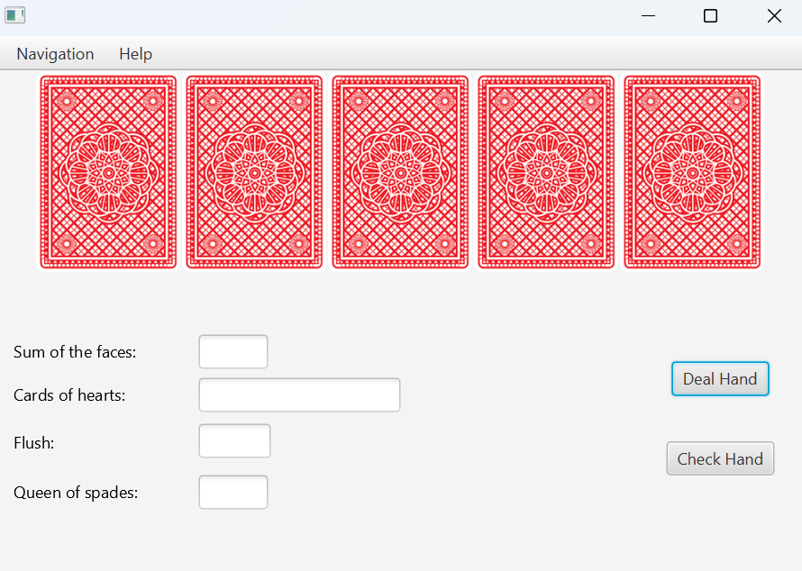
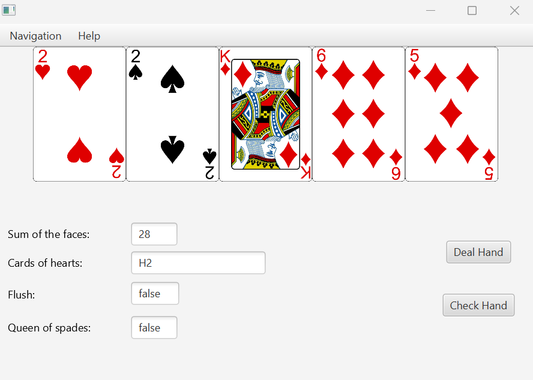

# CardGameApplication

## About
This Java project simulates a deck of playing cards and a hand of cards. It provides functionalities to deal hands of cards, and perform various checks on a hand's contents.

## DeckOfCards Class

### Description

Represents a deck of playing cards with 52 cards, divided equally among 4 suits: Spade, Heart, Diamonds, and Clubs.

### Methods

#### Constructor
- `DeckOfCards()`: Creates a deck of playing cards with 52 cards, each with a unique combination of suit and value.

#### `getRandomPlayingCard()`
- Returns a random playing card from the deck.

#### `dealHand(int amountOfCards)`
- Returns an ArrayList of playing cards representing a hand of the specified number of cards.

#### `getAllPlayingCards()`
- Returns the number of playing cards left in the deck.

## Hand Class

### Description

Represents a hand of playing cards with various functionalities to analyze and manage the cards on hand.

### Methods

#### Constructor
- `Hand()`: Creates a hand of playing cards with 5 cards dealt from the deck.

#### `checkFlushWithMapValues()`
- Returns whether the hand contains a flush (5 or more cards of the same suit) using map values.

#### `checkFlushWithMapKeySet()`
- Returns whether the hand contains a flush (5 or more cards of the same suit) using map key set.

#### `addPlayingCardToHand(PlayingCard playingCard)`
- Adds a playing card to the hand.

#### `getIntValueFromCardsOnHand()`
- Returns the sum of face values of all cards on the hand.

#### `getAllHeartCardsOnHand()`
- Returns the cards of suit Heart on the hand.

#### `getHandSize()`
- Returns the number of cards in the hand.

#### `getCardsOnHand()`
- Returns a list of all cards on the hand.

#### `checkQueenOfSpades()`
- Returns whether the hand contains the Queen of Spades (S12).

## PlayingCard Class

### Description

Represents a playing card with a suit and face value.

### Methods

#### Constructor
- `PlayingCard(char suit, int face)`: Creates an instance of a PlayingCard with a given suit and face.

#### `getAsString()`
- Returns the suit and face of the card as a string.

#### `getSuit()`
- Returns the suit of the card.

#### `getFace()`
- Returns the face value of the card.

## Authors
- Martin Hegnum Johannessen
